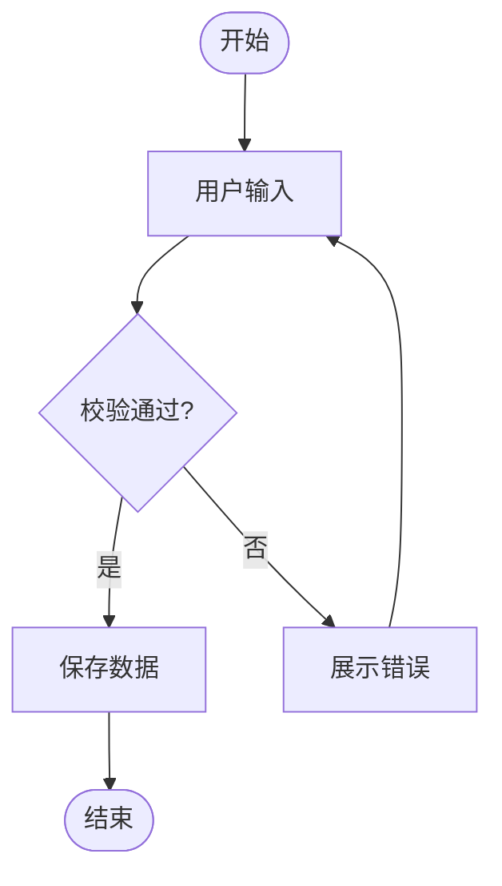

# 通用代码开发规范

本文是面向 Claude Code、Codex、Cursor 以及其他代码代理的通用开发执行规范。进入任何仓库后，必须先阅读本文件，再进行需求分析、文档更新、编码、测试、发布或部署。

本文不绑定某一个产品、竞品、视觉参考或技术栈。项目特定约束应放在该项目的入口文档、`README.md`、`PRD.md` 或架构文档中；项目文档可以追加更严格要求，但不得降低本文的质量、安全和验证标准。

## 0. 基本原则

- 交付必须完整、正确、可维护，禁止用“临时方案”“先跑通”“后续再优化”“简单处理一下”“先 Mock 一下”作为交付理由。
- 交付形态必须符合 PRD 和用户要求；如果产品要求桌面端、移动端、CLI、服务端或嵌入式交付，不得用 Web 页面或其他形态临时代替。
- 需求、`PRD.md`、设计说明、功能列表、Changelog、Release Notes、代码和测试必须保持同步。
- 任何有意义的代码改动都必须能说明影响范围、验证方式和回退方案。
- 新增功能前必须先搜索已有实现，优先复用或扩展，不重复造轮子。
- 禁止猜测性修复。无法确认根因时，先用日志、断点、测试脚本或最小复现验证假设。
- 禁止静默删除功能、静默改依赖、空 `catch`、吞错继续执行危险逻辑、无备份的数据变更。
- 不为赶进度牺牲架构边界、数据安全、测试覆盖、可访问性、可观测性和用户可感知质量。
- **所有改动必须修改项目源代码**（`src/`、`config/`、`electron/` 等），禁止直接修改 `node_modules` 或任何已安装依赖包。
- **本地调试必须通过 Electron 窗口验证**。`npm run dev` 会同时启动 Next.js Dev Server（Turbopack HMR）和 Electron 进程；验证 UI/交互效果时必须在 Electron 窗口中确认，不得仅依赖浏览器访问 `localhost` 就视为通过。

## 1. 新需求处理流程

收到新需求后，按以下顺序处理：

1. 理解上下文。
   - 阅读入口文档、`PRD.md`、相关设计文档和现有代码。
   - 明确业务目标、用户场景、交付形态、已有实现、潜在风险和成功标准。

2. 主动澄清。
   - 对不明确、不一致、会影响架构或交付质量的问题提出澄清。
   - 如果用户已明确授权自主执行，则基于合理假设继续，但必须在文档和最终说明中写清楚假设。

3. 复述需求。
   - 用自己的理解复述目标、范围、输入输出、页面或接口影响、验收条件。
   - 明确不做什么，避免隐含范围扩张。

4. 更新 `PRD.md`。
   - 编码前必须先更新 `PRD.md`，除非本次任务仅是纯代码修复且已有 PRD 完整覆盖。
   - PRD 更新完成后再编码；文档和代码不得脱节。

5. 获取许可。
   - 未获得明确开发许可前，不进入编码阶段。
   - 如果用户当前任务已明确授权“直接执行”“自主处理”等，可以继续编码，但仍必须保持 PRD、测试和交付说明同步。

6. 实现与验证。
   - 按 PRD、项目架构和本文规范实现。
   - 运行与风险级别匹配的测试、CI、打包和可视化验证。

7. 交付说明。
   - 说明改了什么、影响范围、验证结果、未验证项、回退方案和后续需要注意的点。

## 2. PRD 文档规范

### 2.1 文件命名与位置

- PRD 文件名必须是 `PRD.md`，大小写固定，不使用 `prd.md`、`Product.md`、`需求.md` 或其他变体作为主 PRD。
- 默认在仓库根目录维护 `PRD.md`。
- 大型项目可以拆分模块 PRD，但根目录 `PRD.md` 必须作为入口，链接到所有模块文档，并明确当前需求对应的权威位置。
- 新需求、需求变更、功能取消、验收标准变化，都必须更新 `PRD.md`。
- PRD 不是事后补档。实现前要先写清楚，开发中如方案变化要同步修订。

### 2.2 必备内容

`PRD.md` 至少包含：

- 文档版本、状态、最后更新时间、负责人或维护者。
- 背景与问题：为什么要做，解决谁的什么问题。
- 用户与场景：目标用户、关键使用场景、触发条件。
- 目标与非目标：本次做什么、不做什么。
- 功能范围：页面、入口、状态、权限、配置、接口、数据影响。
- 用户流程：主流程、分支流程、异常流程、取消流程、重试流程。
- 业务规则：限制条件、频率规则、状态流转、边界条件。
- UI/UX 要求：布局、控件、图标、反馈、空态、错误态、加载态、可访问性。
- 数据与接口：数据结构、读写路径、迁移影响、接口协议、兼容策略。
- 安全与隐私：敏感数据、权限、日志脱敏、外部服务调用。
- 验收标准：可测试、可观察、无歧义。
- 测试计划：单元、集成、端到端、视觉、回归范围。
- 发布与回退：发布步骤、回退条件、备份路径、恢复方式。
- 变更记录：按时间倒序记录关键 PRD 修订。

### 2.3 Mermaid 流程图要求

- 所有流程图必须使用 Mermaid 语法表示，并放在代码块中：

````md

````

- 禁止使用 ASCII 图、纯文本箭头图、截图、外链图片或只靠文字描述替代流程图。
- 流程图必须完整、清晰，至少覆盖主流程、关键分支、异常流程和结束状态。
- 每张流程图必须有明确起点、终点、决策节点、失败路径和用户可见反馈。
- 涉及异步任务、外部服务、数据库写入、权限校验、重试或回滚时，必须在 Mermaid 图中体现。
- 复杂需求应按用途拆成多张图，例如用户流程用 `flowchart`，接口时序用 `sequenceDiagram`，状态机用 `stateDiagram-v2`，数据关系用 `erDiagram`。
- 节点名称必须表达业务含义，避免 `Step1`、`Do thing` 这类无法审核的占位命名。

### 2.4 验收标准写法

- 验收标准必须可执行、可验证，避免“体验更好”“性能更佳”这类空泛描述。
- 推荐写法：
  - 当用户在某状态下执行某操作，应看到什么结果。
  - 当接口返回某错误，应展示什么反馈并记录什么日志。
  - 当数据迁移失败，应如何回滚。
  - 自动化测试应覆盖哪些路径。
- 每条验收标准都应能映射到测试用例、手动验证步骤或可观察日志。

## 3. 需求变更流程

- 所有需求变更必须先更新 `PRD.md` 或对应设计文档，再改代码。
- 如果变更影响数据结构、接口协议、用户流程、权限、安全、已有测试或发布方式，必须同步更新测试计划和回退说明。
- 如果新方案推翻原方案，必须说明新旧差异、迁移影响、兼容策略和风险。
- 禁止口头确认后直接改代码而不留文档记录。
- 已取消的需求不得直接从文档中删除，应标注“已取消”并说明取消原因、影响范围和是否需要清理代码。

## 4. 批量修改确认机制

修改超过 3 个文件时，必须先列出修改计划并等待用户确认，除非用户已经明确授权大范围自主开发，或当前任务属于紧急修复且风险已说明。

修改计划必须包含：

- 要修改哪些文件。
- 每个文件改什么。
- 改动之间的依赖关系。
- 可能影响的功能范围。
- 数据、配置、接口、依赖是否受影响。
- 预计验证方式和回退方案。

如果执行过程中发现需要新增第 4 个文件或超出原计划范围，必须暂停并补充说明。

## 5. 代码调研与复用

新增功能、修复 Bug 或重构前，必须先搜索已有实现。

搜索范围包括：

- 相关目录和文件名。
- 函数名、类名、组件名、Hook、Store、Service。
- API、IPC、RPC、事件、命令、路由。
- 数据库表、迁移脚本、配置项、环境变量。
- 测试文件、Playground、Storybook、示例页。
- 文档、注释、Changelog、历史设计说明。

执行要求：

- 优先使用 `rg` 或项目现有搜索工具。
- 找到已有实现时，优先复用、扩展或抽象公共能力。
- 不理解上下游依赖时，不得直接复制一份类似代码。
- 如果确实需要新实现，必须说明为什么不能复用已有实现。

## 6. 架构与代码组织

- 优先遵循项目已有架构、命名、目录、状态管理和接口风格。
- 不为了局部便利绕过模块边界、权限边界、数据访问层或服务抽象。
- 单个文件不得承担过多职责；复杂逻辑要拆分为清晰模块。
- 共享逻辑应抽到工具函数、服务层、领域模块或组件库，避免复制粘贴。
- UI、状态、服务调用、数据转换、权限判断、错误处理应保持边界清楚。
- 新增抽象必须解决真实复杂度，不能为了“看起来高级”制造额外层级。
- 公共 API、事件、数据结构、配置项一旦被多个模块依赖，必须有文档或类型定义。
- 删除旧路径、旧字段、旧事件前必须确认调用方，并提供兼容或迁移方案。

## 7. UI/UX 设计规范

### 7.1 基本要求

- UI 必须服务真实工作流，避免用装饰性布局掩盖功能不完整。
- 控件用途要自解释，不能依赖大段说明文字弥补交互不清。
- 所有页面都必须覆盖默认态、加载态、空态、错误态、禁用态、成功态和长内容状态。
- 所有文本必须在目标窗口尺寸内可读，不得溢出、重叠、遮挡或制造无意义横向滚动。
- 桌面端、Web、移动端或嵌入式界面必须分别按其真实交付环境验证。
- 颜色不能作为唯一信息载体；关键状态必须同时有文字、图标、形状或 ARIA 语义。
- 交互密集界面优先保证扫描效率、键盘可达性和状态反馈，不做营销式堆叠。

### 7.2 图标规范

- 严格禁止使用 emoji 作为按钮图标。
- 禁止在按钮、工具栏、菜单、导航、状态标识、空态操作、通知操作中使用 emoji 充当图标。
- 所有按钮图标必须使用 SVG 图标。
- SVG 图标必须优先使用 Lucide 图标集。
- 必须直接下载或提取 Lucide SVG 源文件，并存放在项目本地或内部图标包中使用。
- 禁止依赖 CDN、远程图片 URL、在线 iconfont、外部 sprite、运行时远程拉取图标。
- 不得用 emoji 作为“临时图标占位”。如果暂时找不到合适图标，应先下载合适的 Lucide SVG 或设计本地 SVG。
- 图标源文件建议放在 `assets/icons/lucide/`、`src/assets/icons/lucide/`、`vendor/lucide/` 或项目内部设计系统包中。
- 图标目录必须能追踪来源版本，建议维护 `README.md` 或清单，记录 Lucide 来源、版本、下载时间和许可证。
- 使用图标时应通过本地 import、组件封装或内部图标注册表引用，不得在运行时访问外网。
- 如果 Lucide 没有合适图标，可以新增自定义 SVG，但必须保持与 Lucide 一致的视觉语言，例如线性风格、统一描边、圆角、视窗尺寸和命名规则。
- 图标按钮必须提供 `aria-label`、`title`、Tooltip 或可见文本之一，保证用户知道按钮作用。
- 图标尺寸、描边、颜色、悬停态、按下态、禁用态必须统一，不得在同一工具栏内混用多套视觉风格。

### 7.3 组件与交互

- 图标按钮用于明确命令；二义性命令必须配合文字或 Tooltip。
- 二元状态使用开关、复选框或明确状态按钮；多选项使用下拉、分段控件、Tabs 或菜单。
- 数字输入使用输入框、Stepper、Slider 或组合控件，并处理最小值、最大值、非法值和空值。
-  destructive 操作必须有确认、可撤销或清晰回退路径。
- 表单必须展示字段级错误、整体错误、保存中状态、保存成功反馈和失败重试路径。
- 长列表必须考虑搜索、过滤、排序、分页或虚拟滚动。
- 复杂组件应提供 Playground、Storybook 或等价演示页，方便单独验证状态和样式。

### 7.4 可访问性与输入体验

- 所有可点击元素必须可键盘访问，并有可见焦点态。
- 图标按钮、输入框、表单错误、弹窗、菜单、Tabs 必须有合理 ARIA 或语义标签。
- 输入框必须处理输入法组合状态，尤其是回车发送场景。
- 禁止把重要操作藏在 hover-only 交互中；移动端和触摸屏也必须可用。
- 模态框必须处理焦点锁定、Esc 关闭、背景不可操作和关闭后焦点恢复。

## 8. 输入法 IME 处理规范

所有支持回车发送、回车提交或回车触发命令的输入框，必须处理输入法组合状态。

标准写法：

```ts
const handleKeyDown = (event: React.KeyboardEvent) => {
  if (event.key === 'Enter' && !event.shiftKey && !event.nativeEvent.isComposing) {
    event.preventDefault();
    handleSend();
  }
};
```

要求：

- 输入法确认候选词触发 Enter 时，不得发送消息或提交表单。
- 判断必须使用 `event.nativeEvent.isComposing`。
- 新增输入框时，必须检查是否需要补充 IME 测试。
- 组合输入期间不得触发快捷键、自动提交、自动保存或搜索请求。

## 9. 数据格式与协议

### 9.1 内部数据交换

- 新的 Agentic 工具调用协议、提示词编排、工具入参、工具返回、中间观察结果，优先使用 XML。
- 复杂嵌套结构不得继续堆非结构化字符串。
- 已有 JSON HTTP API 可以保留，除非本次需求明确要求重构协议。
- 对外公共 API 应遵循项目既有协议和生态惯例，不为偏好强行破坏兼容。

### 9.2 XML 工具调用格式

推荐结构：

```xml
<tool_call>
  <name>search_memory</name>
  <arguments>
    <query>项目开发规范</query>
    <limit>5</limit>
  </arguments>
</tool_call>

<tool_result>
  <name>search_memory</name>
  <status>success</status>
  <items>
    <item id="mem_001">需要先更新 PRD，再进入编码。</item>
  </items>
</tool_result>
```

要求：

- 字段命名稳定，不随意缩写。
- 必须区分请求、结果、错误、观察、计划和最终结论。
- XML 中的自由文本必须考虑转义、长度、嵌套和解析失败处理。
- 工具协议变化必须有版本号、兼容策略和迁移说明。

### 9.3 人工维护配置

- 人工维护的配置、策略、Prompt 清单、规则清单优先使用 YAML。
- YAML 结构必须有注释、示例、默认值和字段含义说明。
- 机器高频读写数据可以继续使用数据库、二进制索引或结构化存储，不强行转 YAML。
- 不得把需要人工长期维护的复杂规则塞进硬编码常量。

## 10. 数据库、迁移与备份

- 涉及数据库结构、数据迁移、批量写入、删除、清洗或不可逆转换时，执行前必须备份。
- 备份必须放在项目约定目录，例如 `backups/`，并记录文件路径、时间、数据范围。
- 迁移脚本必须可重复执行，或能检测已执行状态。
- 所有数据变更必须有回退方案，包括如何恢复、需要哪些备份、预计耗时、可能丢失的数据范围。
- 禁止在没有备份和回退方案的情况下执行破坏性数据操作。
- 数据库变更必须同步更新 schema 文档、类型定义、种子数据、测试数据和 CI 配置。
- 涉及真实用户数据时，日志和备份不得泄露敏感字段、完整 Token、完整 API Key 或隐私内容。

SQLite 备份示例：

```bash
cp database.db backups/database_$(date +%Y%m%d_%H%M%S).db
```

## 11. 错误处理与日志

### 11.1 错误处理

- 所有 `try/catch`、错误分支、Promise rejection、回调错误都必须有实质性处理。
- 实质性处理至少包含日志记录、用户可见反馈、合理降级、重试、回滚或中断危险流程之一。
- 禁止空 `catch`。
- 禁止吞掉错误后继续执行可能破坏数据或误导用户的逻辑。
- 错误信息要保留请求、用户操作、数据标识、调用栈、外部服务状态等必要上下文。
- 用户可见错误要可理解、可行动，不暴露内部堆栈和敏感信息。

### 11.2 日志要求

- 调试问题时先看已有日志，不足时补充日志再验证。
- 前端日志应包含页面或组件上下文、关键输入、响应摘要、错误堆栈。
- 后端日志应包含请求来源、时间戳、关键分支、外部服务调用、错误详情。
- 日志必须脱敏，不记录完整 API Key、Token、密码、身份证件、隐私内容或未授权数据。
- 临时调试日志交付前要么删除，要么降级为受控的 debug 日志。

## 12. Bug 修复规范

修复 Bug 前必须先调研完整业务链路。

修复前必须回答：

- Bug 所在功能的完整流程是什么？
- 根因是什么，证据是什么？
- 修改会影响哪些模块、接口、数据、状态或测试？
- 是否有其他地方存在同类问题？
- 如何验证修复有效且没有回归？

禁止事项：

- 禁止只盯报错点局部修改。
- 禁止未验证假设就提交修复。
- 禁止用扩大 catch、忽略异常、跳过校验、默认成功等方式掩盖问题。
- 禁止为了让测试通过而降低真实业务约束。

## 13. 依赖变更规范

任何依赖文件变更都必须主动说明，包括 `package.json`、锁文件、`requirements.txt`、`pyproject.toml`、`Cargo.toml`、`go.mod`、插件配置等。

说明必须包含：

- 新增、升级、降级或移除了什么依赖。
- 为什么需要这个依赖。
- 为什么选择该版本。
- 是否影响许可证、包体积、启动性能、打包、部署、安全扫描。
- 是否有替代方案，为什么不选。
- 如何回退。

禁止事项：

- 禁止静默安装或移除依赖。
- 禁止为了一个很小的问题引入大型依赖，除非收益明确。
- 禁止绕过锁文件或让依赖版本漂移。
- 禁止在没有安全评估的情况下引入来源不明的包。

## 14. 测试与 CI

### 14.1 测试覆盖

有意义的代码改动必须运行项目 CI。测试范围根据风险确定，但不得低于改动影响面。

优先覆盖：

- 核心业务逻辑。
- API、IPC、RPC、事件和命令。
- 数据处理、迁移、权限、错误分支。
- UI 关键流程、表单校验、空态、错误态、输入法、键盘操作。
- 外部服务失败、超时、重试、取消和降级。

### 14.2 验证要求

- 单元测试验证纯逻辑和边界条件。
- 集成测试验证模块协作和数据读写。
- 端到端测试验证用户真实流程。
- UI 变更必须进行可视化验证，确认没有文字溢出、元素重叠、按钮不可点、主流程被阻断。
- 桌面交付改动必须打包，并对打包后的应用做可视化验证。
- AI、支付、邮件、存储、第三方 API 等外部能力，交付前必须用真实可用配置验证；缺少 Key 或权限时必须明确说明，不能用 Mock 冒充成功。

### 14.3 未能运行测试时

如果无法运行某项测试，必须说明：

- 哪个命令没有运行。
- 为什么不能运行。
- 已做了哪些替代验证。
- 剩余风险是什么。
- 用户或后续维护者如何补跑。

## 15. 文档、Changelog 与 Release Notes

- 代码行为变化必须同步更新相关文档。
- 用户可感知功能变化必须更新 Release Notes。
- 修复 Bug、完成功能、变更接口、调整数据结构、升级依赖必须更新 Changelog。
- 写 Changelog 前必须读取当前系统时间，确保日期准确。
- Changelog 应按时间倒序记录，包含变更类型、影响范围、验证方式。
- Release Notes 面向真实用户，只写用户能感知的变化，不写内部文件路径、调试日志、重构细节或用户无感知优化。
- 文档不得删除历史背景和设计意图；过时内容应标注废弃、替代方案和日期。

## 16. 代码注释规范

- 非显而易见的函数、方法、路由处理器、工具函数、复杂组件必须写清楚背景、设计意图和关键约束。
- 注释重点解释“为什么这样做”，不要重复代码已经表达的“做了什么”。
- 更新或重构函数时，禁止随意删除已有背景说明和设计意图注释。
- 如果实现变化导致原注释不准确，必须同步更新注释。
- 禁止以“注释太长”“代码自解释”“顺手清理”为由删除有价值注释。

推荐注释内容：

- 背景：为了解决什么业务问题，在什么场景下调用。
- 设计意图：为什么选择该方案，放弃了哪些备选方案。
- 关键约束：副作用、依赖、边界条件、调用顺序、兼容要求。

## 17. 代码删除与重构

- 删除任何已有功能代码前，必须明确告知用户并说明理由。
- 重构以保持行为一致为前提，不得夹带功能删除或语义变化。
- 禁止静默删除代码、测试、文档、配置、迁移脚本或示例。
- 如果认为某段代码应移除，先标注 `TODO: 建议移除 - 原因: xxx`，并在交付说明中告知。
- 删除公共 API、配置项、数据库字段或用户可见入口前，必须提供迁移、兼容或回退方案。
- 重构后必须运行能证明行为未变的测试；没有测试时应先补充关键路径测试。

## 18. 安全与隐私

- 不得在代码、日志、截图、测试快照或文档中暴露密钥、Token、密码、私有证书或隐私数据。
- API Key 输入框是否明文显示，应服从产品和安全设计；无明确要求时要提供显示/隐藏切换，不在日志中记录输入值。
- 敏感配置必须通过项目约定的安全渠道读取，不硬编码。
- 外部请求必须处理超时、失败、重试、取消和错误分类。
- 文件上传、路径操作、压缩解压、命令执行必须防止路径穿越、命令注入和越权访问。
- 权限判断必须在可信边界执行，不能只依赖前端隐藏按钮。
- 涉及高风险操作时，需要确认、审计日志和回退方案。

## 19. 发布与回退

- 发布必须走项目约定流程，例如 GitHub、CI/CD、包管理器、应用商店或内部发布系统。
- 不允许直接复制文件到生产环境作为正式发布方式，除非这是项目明确规定的发布流程。
- 发布前必须检查实际 diff 与 Release Notes 是否一致。
- 发布前必须确认配置、环境变量、数据库迁移、依赖、构建产物、版本号和回退路径。
- 出现紧急热修复时，可以先处理事故，但事后必须补齐 commit、文档、测试和复盘记录。
- 每次交付都要说明回退方式；涉及数据变更时必须说明恢复备份的具体路径。

## 20. 组件演示与 Playground

涉及复杂 UI、可复用组件、动画、AI 对话、富交互表单、数据可视化时，必须创建或维护 Playground、Storybook 或等价演示页。

演示页应包含：

- 每个核心状态的独立 demo。
- 默认态、加载态、空态、错误态、禁用态、长内容态。
- 关键交互路径和边界输入。
- 可调参数，方便单独调试样式和行为。
- 涉及 Prompt 或 Agent 的交互，应列出使用到的 Prompt、工具协议和状态输入，方便验证。

需求变化后必须同步更新演示页。取消功能时不直接删除 demo，应标注取消原因和替代方案。

## 21. 交付说明格式

最终交付说明应包含：

- 改动摘要：具体改了什么。
- 影响范围：哪些页面、模块、接口、数据、配置或用户流程可能受影响。
- 验证结果：运行了哪些命令，结果如何。
- 未验证项：哪些没有验证，原因是什么。
- 数据与依赖：是否改了数据库、配置、依赖、环境变量。
- 回退方案：如何恢复到改动前状态。

推荐格式：

```text
影响范围：聊天输入、消息发送、设置保存
验证：npm run typecheck；npm run test:e2e
回退：恢复本次提交；数据库未变更
```

## 22. 禁止清单

以下行为默认禁止：

- 用临时实现、Mock、硬编码假响应冒充完整功能。
- 未更新 `PRD.md` 就实现新需求。
- PRD 使用非 `PRD.md` 文件名作为主文档。
- 使用非 Mermaid 的流程图。
- 使用 emoji 作为按钮图标。
- 使用 CDN 或远程 URL 加载图标。
- 不下载 Lucide SVG，直接依赖外部图标资源。
- 猜测性修复。
- 静默删除代码、测试、文档、配置或依赖。
- 空 `catch` 或吞错继续执行危险逻辑。
- 无备份执行数据库结构或数据变更。
- 无测试或无说明交付有意义的代码改动。
- 为了通过测试降低真实业务约束。
- 在日志、文档或截图中泄露敏感信息。
