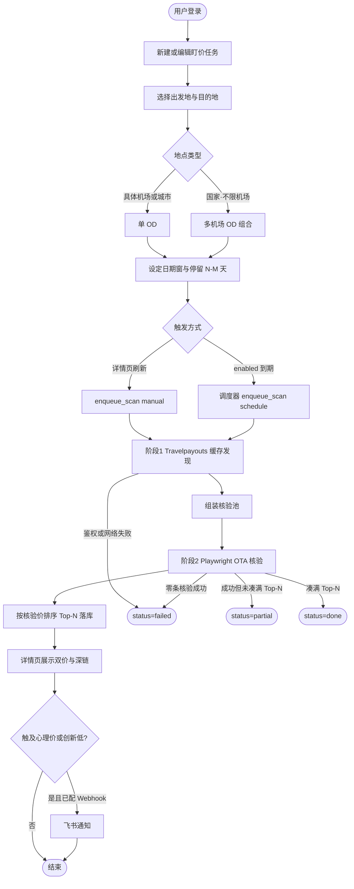
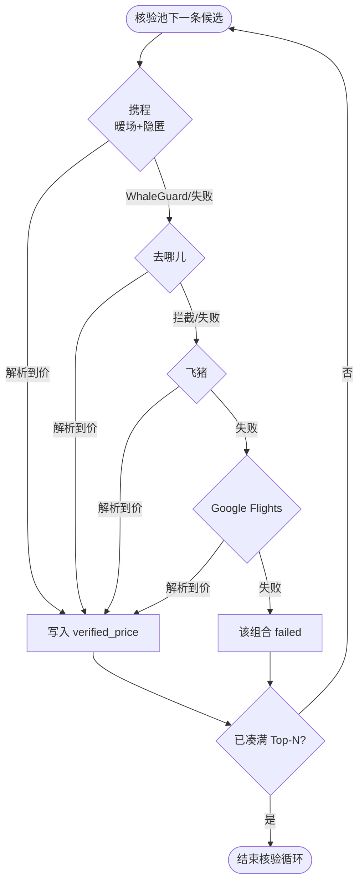
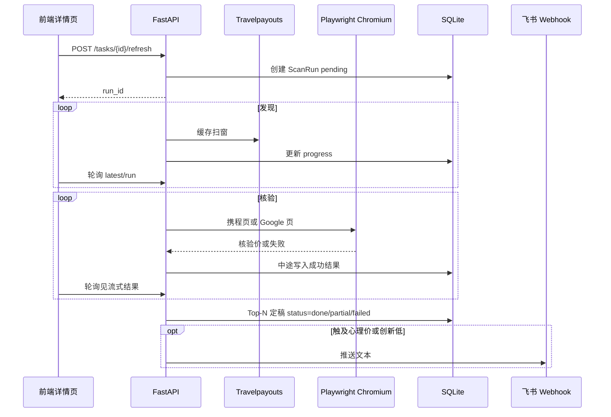
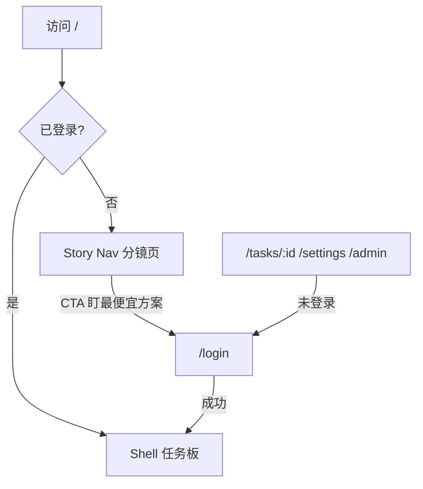

# Gatefare · Flight Monitor — PRD

| 字段 | 内容 |
|------|------|
| 文档版本 | 1.10 |
| 状态 | Active |
| 最后更新 | 2026-07-30 |
| 产品名 | Gatefare（Flight Monitor） |
| 技术栈 | FastAPI + SQLite + React（Vite）；查价全程免费（无付费航班 API） |
| 维护说明 | 新需求 / 行为变更须先修订本文再改代码；流程图一律 Mermaid |

---

## 1. 背景与问题

用户常有「大概哪几天出发、停留几天」的模糊出行计划，需要在**出发日期窗**内，按停留 **N–M 天**筛出往返低价，并尽量看到：

1. 可核对的 **OTA 真价**（不是仅靠缓存板）；
2. 日期 / 航线一致的 **携程 / 去哪儿 / Google** 深链；
3. 可选的 **定时盯价 + 飞书通知**。

不愿为查价支付商业航班搜索 API 费用；也不接受 demo / mock 价冒充生产成功。

**核心矛盾**：免费缓存价（Travelpayouts）覆盖广但易过时；OTA 页面有真价但自动化易被反爬。产品用「缓存发现 + Playwright 真开页核验」折中，并规定**排序只信核验价**。

---

## 2. 用户与场景

| 角色 | 说明 |
|------|------|
| 个人出行者 | 从中国大陆 / 港澳台出发，查国内或出境往返 |
| 管理员 | 本地部署，建账号、配 `.env`、看健康检查 |

**场景 A · 一次性扫价**  
例：港→阪、京→沪、深→曼谷。建任务 → 立即刷新 → 详情页看 Top-N 核验价与链接。

**场景 B · 定时盯价**  
开启 `enabled`，按 `interval_hours` 重复同一扫价核心；触及心理价或创历史低时飞书 Webhook 通知。

**场景 C · 国家不限机场**  
只知道国家（如柬埔寨），选「国家 · 不限机场」，系统展开该国**主要机场**多 OD 组合扫价。

**场景 D · 具体城市 / 机场**  
搜索「珠海」「HKG」等，选中单一城市码或机场，单 OD 扫价。

---

## 3. 目标与非目标

### 3.1 目标

- **免费查价管线**：Travelpayouts 缓存发现 → Playwright OTA 核验（**携程 → 去哪儿 → 飞猪 → Google Flights**）→ 按**核验价**排序 Top-N（默认 ≥10）。
- **双价透明**：同时保留 `cache_price`（缓存）与 `verified_price`（核验）；推荐与告警只用核验价。
- **深链保真**：携程 / 去哪儿 / Google 链接与任务日期、航线一致，供人工再核对。
- **进度可感知**：发现 / 核验阶段持续写 `progress_message`，详情页 Live 更新。
- **地点能力**：国家 / 城市 / 机场搜索；「不限机场」；中国大陆可飞城市本地全量目录。
- **Fail-closed**：缺 token、demo 模式、TP 失败、核验全失败 → 明确 `failed`，禁止假成功。

### 3.2 非目标

- 不提供自动下单、锁价、座位 / 行李保证。
- 不接入付费航班搜索 API 作为生产主路径。
- 不用 demo / mock / 仅深链板冒充扫价成功。
- 「中国大陆（不限机场）」**不**展开全部数百城市（组合爆炸）；仅主要枢纽。具体城市须搜索选中。
- 不保证携程自动化在反爬环境下稳定成功（见 §6.3）；Google 回落为设计内路径，不是临时补丁。

---

## 4. 功能范围

### 4.1 账户与系统

- 登录（JWT）；管理员建用户。
- 账户页：飞书 Webhook、健康状态（token / Playwright / TP 探测）。
- `GET /api/health`：生产就绪探针。
- **公开电影式导航页**（未登录访问 `/`）：滚动叙事教用户「自动找到最便宜出行日期」，CTA 进入登录；已登录访问 `/` 仍为任务板（见 §8.3）。

### 4.2 任务

- 任务 CRUD；字段含起降地标签、`origin_codes` / `dest_codes`、日期窗、停留、成人、币种、`top_n`、心理价、定时间隔、`enabled`。
- 立即扫价：`POST /api/tasks/{id}/refresh`。
- 定时：后台调度器约每分钟检查到期任务，触发与手动相同的扫价核心。

### 4.3 地点

- `GET /api/places/suggest` + 前端 `PlaceField`。
- 中国大陆目录：`backend/app/data/cn_cities.json`（可用 `scripts/refresh_cn_cities.py` 从 Travelpayouts 刷新）。
- 国家不限机场 → 多 IATA 写入 `*_codes`。

### 4.4 扫价与结果

- 多 OD 发现 → 核验池 → Playwright 核验 → Top-N 落库。
- 结果字段：缓存价、核验价、航班摘要、`source`（如 `CtripVerified` / `GoogleFlightsVerified`）、三平台深链。
- 扫价中途可流式写入已成功核验结果，供详情页边跑边看。

### 4.5 通知

- 配置用户级飞书 Webhook 后，触及心理价或低于历史最低核验价时可推送文本告警。

---

## 5. 完整产品链路（权威说明）

### 5.1 端到端总览



### 5.2 阶段 1 · Travelpayouts 缓存发现（HTTP API）

**不是 Playwright。** 使用 Travelpayouts 免费缓存接口，按「出发码 × 到达码 × 日期组合」扫窗。

| 项 | 行为 |
|----|------|
| 输入 | `origin_codes`、`dest_codes`、`start_date`–`end_date`、`stay_min`–`stay_max`、成人、币种 |
| 输出 | 有价 `FlightOption`，写入 `cache_price`；`verify_status=pending` |
| 用途 | **仅初筛**：哪些日期/航线值得核验；**不参与**最终排序与「最低价」展示口径 |
| 并发 | 同一 OD 内多日期组合并行请求（默认 `TRAVELPAYOUTS_CONCURRENCY=6`）；全局限速槽位间隔默认 `TRAVELPAYOUTS_REQUEST_DELAY=0.2s`（官方 `/v3/prices_for_dates`≈600/min，默认约一半余量） |
| 限流 | HTTP 429（及可识别的限流响应）→ 暂停并退避重试；`progress_message` / 扫描日志须对用户可见（如「缓存接口限流，暂停约 N 秒后重试…」）；重试耗尽 → 整次 `failed`，文案可行动 |
| 多机场 | 逐 OD 扫；单机场「不可飞 / HTTP 400 not flightable」可跳过并继续 |
| 失败 | Token 缺失、`USE_DEMO=true`、不可恢复的网络/鉴权/限流耗尽 → 整次 `failed` |
| 网络 | 默认直连；代理须显式 `HTTPS_PROXY` / `TRAVELPAYOUTS_PROXY` |

进度示例：`缓存扫窗 8/28 · HKG→KIX`；限流时覆盖为限流提示，恢复后继续计数进度。

**非目标（本期不做）**：先用月历/分组粗价筛便宜区间再细扫具体日期组合（「先粗后细」）；仍按完整日期×停留组合发现。

### 5.3 核验池组装

在进入 Playwright 前，从日历发现结果组装候选池（`select_calendar_verify_pool`）：

1. **优先**：去程+回程日历均有价、且停留天数合法的组合，按两腿价和升序截取；
2. **Google 单程补洞**：TP 缺日时按预算补扫单程最低价后再匹配；
3. **国内空池回落**：若匹配后仍无候选且 OD 均为国内，按日期窗均匀插入「骨架」候选（`cache_price=0`）直进 OTA 核验——避免稀航线因 TP 无缓存 + Google 补洞失败在发现阶段硬失败；
4. **国际空池**：不默认开骨架（避免无信号烧预算）；失败文案须带去/回有价天数与匹配数；
5. 池大小约 `max(top_n, min(top_n×2, calendar_candidate_k))`；为每条候选挂上 Google / 携程 / 去哪儿深链。

> 骨架候选不是 mock 成功：仍须 Playwright 核验出 `verified_price` 才算有效结果。

### 5.4 阶段 2 · Playwright OTA 核验（多平台回落）

**所有 OTA 核验都走 Playwright**（优先系统已装 Chrome `channel=chrome`，否则 Chromium）。  
默认 `OTA_VERIFY_HEADLESS=true`（无窗口）；可改为 `false` 降低部分反爬命中率（会弹出浏览器窗口）。  
**不存在**独立付费 Google / 携程官方查价 API。



| 规则 | 说明 |
|------|------|
| 优先序 | 携程 → 去哪儿 → 飞猪 → Google Flights |
| 携程强化 | 去 automation 默认参数、webdriver 隐匿、中文时区/语言、先访问航班首页暖场再进列表、轻量滚动 |
| 硬拦截记忆 | 本轮遇 WhaleGuard/安全验证时标记 `skip_ctrip` / `skip_qunar` / `skip_fliggy`，后续候选跳过该源 |
| 成功写价 | `verified_price = OTA 价`；`source` 为 `CtripVerified` / `QunarVerified` / `FliggyVerified` / `GoogleFlightsVerified`；**保留** `cache_price` |
| 排序 | 仅核验成功条目按核验价升序 |
| 全失败 | `failed`，禁止用未核验缓存价冒充 |
| 反爬预期 | **不承诺**任何一家 OTA 自动化 100% 不被拦；多源是为提高「至少一家出真价」的概率 |
| Google 等待 | 打开后等价格符号（¥/￥，约 8s）即可继续，**不**空等 `networkidle`；回程轮询缩短；候选间隔默认 `CTRIP_VERIFY_DELAY_SEC=0.6`。2G 机仍串行单浏览器，不做多开并行 |

**价差语义（产品承诺）**  

若 API 缓存为 1000、OTA 核验为 1010：排序与最低价 = **1010**；缓存 1000 仅对照。

### 5.5 落库、展示与通知



详情页展示：

- 进度阶段（`discovering` / `verifying`）与文案；
- Top-N：日期、停留、缓存价、核验价、摘要、`source`、三深链；
- 文案须提示：核验价来自扫价时 OTA 页面；下单前请再打开链接确认现价。

---

## 6. 业务规则

### 6.1 Fail-closed

下列情况**不得**展示「扫价成功 + 假价格」：

| 条件 | 期望 |
|------|------|
| 无 `TRAVELPAYOUTS_TOKEN` | 拒绝扫价 / health 非 ok |
| `USE_DEMO=true` | 生产扫价禁用 |
| TP 发现阶段不可恢复失败 | `failed` |
| Playwright 未安装 | 启动扫价即失败并提示安装 |
| 核验池全部失败 | `failed`，不得回落「只展示缓存 Top-N」 |

### 6.2 价格与排序

- 推荐排序、任务 `min_price`、`best_price_seen`、飞书告警比较：**只用核验价**。
- `cache_price`：初筛与 UI 对照；可为 0（骨架候选或 TP 无价）。
- `top_n` 下限 **10**，上限受配置 / schema 约束（如 ≤50）。

### 6.3 OTA 核验与反爬

- 默认 headless Playwright；顺序：携程 → 去哪儿 → 飞猪 → Google。
- 硬拦截 → 本轮跳过该源；其余源继续。
- 任一国内 OTA 失败**不代表**核验关闭；Google 仍为最后回落。
- 深链「真人可开」与「自动化可解析」分开验收。
- `OTA_VERIFY_HEADLESS=false` 为可选降反爬手段，不作为默认（无头服务友好）。

### 6.4 多机场与地点

- `origin_codes` / `dest_codes`：逗号分隔 IATA；扫价笛卡尔组合发现。
- 国家不限机场：只扩主要机场列表。
- 中国大陆搜索：本地全量可飞城市；「中国大陆（不限机场）」仍只枢纽。

### 6.5 定时与通知

- 调度与手动共用 `enqueue_scan` 核心。
- 飞书：用户配置 Webhook；未配置则静默跳过通知。
- 通知触发：触及 `target_price` 或低于 `best_price_seen`（以实现代码为准，变更须同步本节）。

### 6.6 配置与代理

- Travelpayouts **默认直连**。
- 需要代理时显式设置环境变量；禁止依赖系统残留死代理导致误失败。

---

## 7. 数据与接口（摘要）

### 7.1 关键持久化

| 实体 | 要点 |
|------|------|
| `WatchTask` | 航线、日期窗、停留、codes、top_n、心理价、间隔、enabled、best_price_seen |
| `ScanRun` | status（pending/running/done/partial/failed）、phase、progress_*、min_price、error、notify_message |
| `FlightResult` | rank、日期、trip_days、cache_price、verified_price、total_price、verify_status、source、三 verify_url_* |

SQLite 新列通过 `ensure_schema` 可重复迁移。

### 7.2 主要 API

| 方法 | 路径 | 说明 |
|------|------|------|
| POST | `/api/auth/login` | 登录 |
| GET | `/api/health` | 就绪：token / TP / Playwright |
| GET | `/api/places/suggest` | 地点建议 |
| CRUD | `/api/tasks` | 任务 |
| POST | `/api/tasks/{id}/refresh` | 触发扫价 |
| GET | `/api/tasks/{id}/runs/latest` | 最新一次运行（含结果） |
| GET | `/api/tasks/{id}/runs/{run_id}` | 指定运行 |

前端生产静态资源：`backend/static`；开发可用 Vite `5173` 代理。

---

## 8. UI/UX

### 8.1 工作流要求

- 覆盖默认 / 加载 / 空 / 错误 / 禁用 / 成功 / 长列表。
- 扫价中必须持续有进度反馈（文案 + 比例）。
- 结果同时露出缓存价与核验价，避免用户误以为缓存即下单价。
- 破坏性操作需确认；表单有字段级与整体错误。
- 回车提交处理 IME：`nativeEvent.isComposing === true` 时不提交。

### 8.2 视觉（复古航空邮件 · 2026-07-24）

**方向**：复古航空邮件风，拒绝霓虹/赛博装饰。信息优先，动画仅保留状态反馈。

- **配色**：背景牛皮纸 `#E9E2D2`、卡片奶油纸 `#F4EFE3`、边框 `#D8CDB4` / `#B3A482`；主色墨绿 `#1F4D3A`；价格朱红 `#C8352F`；成功绿 `#3F7D5D`。
- **航空斜纹**：卡片/列表/表格顶部 4px 红绿相间 -45° 斜纹；芯片虚线框呼应邮票齿孔。
- **字体**：本地 woff2。标题/大数字 Playfair Display + 中文宋体回退；正文系统黑体；数据 IBM Plex Mono + `tabular-nums`。
- **图标**：本地 Lucide SVG（`frontend/src/components/Icon.tsx`）；禁止 emoji 作操作图标；禁止 CDN 图标。
- **动效**：淡入、骨架、进度、数字缓动、终端光标；尊重 `prefers-reduced-motion`。
- **布局**：顶栏（品牌 + 导航 + 健康 chip + 账户）；任务板统计条 + 主从分栏；详情页双列监控台（进度/日志 + 最低价）+ Top-N 表。

### 8.3 公开电影式导航页（Story Nav · 2026-07-27）

**定位**：不是传统营销落地页 / Feature 列表。未登录用户在 `/` 进入**可交互产品演示**（滚动分镜）。**核心卖点**：用户只需给出**模糊出行区间**与**出行意向**（不必钉死具体日期/机场），产品负责扫遍候选并**盯出最便宜的出行方案**——不是「搜某一班航班」。

**动效哲学（Premium 电影感）**：主目标仍是让用户「体验」能力（拖日期窗、点国家、看核验），约 30 秒内建立信任。动效采用 **Premium** 人格（LottieFiles motion-design）：分意图缓动、Setup→Action→Resolution、primary / secondary / ambient 三层。允许为质感服务的轻量手段——浅景深入场、克制环境光漂移、轻滚动视差、机场航线描线、核验态微脉冲等——但须服务叙事，避免廉价弹跳与无意义粒子。交互拖拽须零延迟跟手。匀速节拍器（每行等时扫描）禁止。

**Hero 节拍（强制）**：`h1` 痛点问句立即可见 → 加权日期比较/淘汰 → 静帧 → 定格最便宜日与洞察同帧 → 约 3s 内单一主 CTA；提供 Skip；结论须有文字标签（非仅靠颜色）；示意价须标注；主 CTA 出现前可用下滑提示，出现后收敛。

**路由**



**文案语言**：Story Nav **全文中文**；语气偏软安心口语（「行程还在酝酿」系）。叙事主轴：「模糊区间 + 出行想法 → 盯最便宜那一程」，避免写成普通搜航班广告。

**分镜（每幕只回答一个问题）**

| 幕 | 文案要点 | 动画如何解释 |
|----|----------|--------------|
| 1 | 行程还在酝酿，完全正常 / 最划算组合会浮出 | 日历比较 → 定格最划算组合 |
| 2 | 「大概那两周」就可以开工 / 拖出区间我来替你找 | 可拖拽日期窗 |
| 3 | 最合适机场不用先猜 / 成田还是羽田比完再说 | 点国家 → 多机场展开 |
| 4 | 找到了再确认真价 / 能买到才留下 | OTA 核验勾选 |
| 5 | 设好区间先做别的 / 飞书轻轻提醒 | 通知滑入 |
| 6 | 一点点意向就够出发 → CTA「帮我盯着」 | 能力复述 + 收官 |

**视觉与动效（仅本页）**：slate 夜色底 + 环境光。布局对齐 Linear / Raycast 产品演示段：**统一 max-width 外框 + 相同 gutter**；中段为 `rail | stage` 顶对齐双栏（Hero 为 stage|rail 翻转）；舞台列保留最小高度。**每幕独立主题色与舞台质感**（日期暖绿 / 日期窗青绿图表 / 机场琥珀卡片 / 核验终端绿 / 通知冷蓝手机 / 终幕高对比清单），避免六幕同一皮肤。Playfair 标题 + 斜体强调 + IBM Plex Mono 编号/数据；动效 200–700ms（Hero CTA 约 3s）。尊重 `prefers-reduced-motion`。示意数据仅为教学演示。登录后应用内 UI 仍遵循 §8.2。

**统一入场语法（v1.6）**：六幕共用「航站调度接力」而不是各自堆特效。背景只保留一条随滚动逐段点亮的航线，顶栏同步显示当前 `GF-0N / 幕名`；每幕进入视口时采用短促景深落位（外框 → 文案 → 舞台），舞台边缘扫描光只承担“系统正在接管本幕”的提示。航线与扫描光不得遮挡交互或正文；动效结束后保持静止，避免持续运动造成疲劳。窄屏隐藏大航线，`prefers-reduced-motion` 下关闭描线、扫描与景深位移，但保留幕名和完整内容。

**验收（导航页）**

- 未登录 `/` 看到分镜叙事；CTA → `/login`；已登录 `/` 为任务板。
- 幕 2 日期窗可拖；幕 3 点击国家后机场展开；幕 4 出现核验勾选过程。
- 滚动六幕时，顶栏幕名与侧边进度一致；背景航线只随滚动推进，不无限循环。
- 关动画偏好时无眩晕循环，关键文案与 CTA 仍可读可点。

---

## 9. 安全与隐私

- `.env` 不入库；不在日志中打印完整 Token / JWT / Webhook 密钥。
- 权限在后端校验（任务归属用户）。
- 外部调用（TP / OTA / 飞书）须有超时与错误分类；禁止空 `catch` 后假装成功。
- **公开模式扫价限流**：`PUBLIC_MODE=true` 时，创建任务与立即扫描合计按 IP 限流（默认每小时 5 次），超限返回 HTTP 429。`PUBLIC_SCAN_IP_WHITELIST`（逗号分隔）与本机 loopback（`127.0.0.1` / `::1`）豁免限流。

---

## 10. 验收标准

### 10.1 健康与配置

- 正确配置 token 且安装 Playwright 时，`GET /api/health` → `ok=true`，`demo=false`，`travelpayouts_ok` / `playwright_ok` 合理。
- `USE_DEMO=true` 或无 token 时不得扫价成功。

### 10.2 扫价管线

- 典型航线真实扫价可至 `done` / `partial` / `failed` 终态之一；禁止永久卡在 `running` 无进度。
- 成功结果：`verify_status=ok`，`verified_price` 有值；排序按核验价。
- 存在缓存价时：`cache_price` 与 `verified_price` 可不同，且**展示最低价 = 核验价**（例如缓存 1000、核验 1010 → 推荐 1010）。
- `source` 为 `CtripVerified` / `QunarVerified` / `FliggyVerified` / `GoogleFlightsVerified` 之一；允许因反爬大量落在后方源。
- 核验全失败 → `failed`，结果集不得用纯缓存价冒充 Top-N 成功。

### 10.3 地点与深链

- 「柬埔寨」等可选不限机场，`dest_codes` 含多 IATA。
- 「珠海」「日照」等大陆城市可被 suggest；「中国大陆（不限机场）」仅为枢纽列表。
- 去哪儿 / Google 深链可打开；携程 URL 形态正确（自动化抓取另论）。

### 10.4 进度与 UI

- 扫价中详情页进度文案与百分比（或等价进度字段）持续更新。
- 发现阶段遇 TP 限流时，进度/日志出现可读提示（含暂停秒数或「正在减速重试」），不得静默卡住无文案。
- 核验中途可见已成功条数增加（流式结果）。
- 未登录访问 `/` 为电影式导航页；已登录为任务板；见 §8.3。

### 10.5 定时与通知

- `enabled=true` 的任务在间隔到达后会再次入队扫价。
- 配置有效 Webhook 且触发条件满足时可收到飞书文本（网络可达时）。

---

## 11. 测试计划

| 层级 | 内容 |
|------|------|
| 单测 | `tests/`：deeplinks、places、fail-closed、TP 客户端、核验解析、核验池等 |
| 集成 / E2E | `GET /api/health`；真实 token 扫典型航线至终态；抽查双价与 `source` |
| UI | 前端 build 部署 `backend/static` 或 Vite 代理；主流程目视 |
| 回归 | 多机场跳过不可飞；代理未设时 TP 直连；WhaleGuard 后仍能 Google 出数 |

命令参见 `README.md` / `AGENTS.md`：

```bash
set PYTHONPATH=backend
python -m pytest tests/ -q
```

---

## 12. 发布与回退

| 方式 | 说明 |
|------|------|
| 本地 | `start_web.bat` 或 `PYTHONPATH=backend` + uvicorn `:8000`；前端 build → `backend/static` |
| Docker | `docker compose up --build`（镜像含 Playwright Chromium） |
| 回退 | 还原 Git 提交；SQLite 新增列一般可保留；勿提交 `.env` |

发布前核对：实际行为与本文 §5–§6、`CHANGELOG.md` 叙述一致。

---

## 13. 关键实现映射（便于研发）

| 能力 | 主要路径 |
|------|----------|
| API 入口 | `backend/app/main.py` |
| 任务 / 扫价触发 | `backend/app/routers/tasks.py` |
| 扫价编排 | `backend/app/services/scanner.py` |
| TP 发现 | `backend/app/services/travelpayouts.py` |
| Playwright 核验 | `backend/app/services/ctrip_verify.py` |
| 深链 | `backend/app/services/deeplinks.py` |
| 地点 | `backend/app/services/places.py`、`routers/places.py` |
| 调度 | `backend/app/services/scheduler.py` |
| 飞书 | `backend/app/services/feishu_notify.py` |
| 任务板 / 详情 | `frontend/src/pages/Tasks.tsx`、`TaskDetail.tsx` |
| 公开导航页 | `frontend/src/pages/StoryNav.tsx`、`frontend/src/styles/story.css` |
| 地点控件 | `frontend/src/components/PlaceField.tsx` |

---

## 14. PRD 变更记录

| 日期 | 说明 |
|------|------|
| 2026-07-30 | **v1.10**：公开模式扫价按 IP 限流；支持 `PUBLIC_SCAN_IP_WHITELIST` 与本机 loopback 豁免。 |
| 2026-07-30 | **v1.9**：日历匹配空池时，国内航线回落均匀骨架直核验；失败文案带去/回有价统计；国际仍不默认开骨架。 |
| 2026-07-28 | **v1.8**：发现默认并发 6 / 间隔 0.2s；Google 核验去掉 networkidle 空等，缩短价格/回程轮询与候选间隔（仍串行单浏览器）。 |
| 2026-07-28 | **v1.7**：阶段 1 缓存发现改为有限并行 + 略增请求间隔；HTTP 429 限流须写入可见进度文案并退避重试；明确「先粗后细」月历粗筛为非目标。 |
| 2026-07-27 | **v1.6**：Story Nav 入场动画统一为「航站调度接力」：滚动描线、当前幕航站读数、分层景深入场与一次性舞台扫描；补充窄屏和减少动态效果验收。 |
| 2026-07-27 | **v1.5**：新增未登录 `/` 电影式导航页；已登录 `/` 仍为任务板。Story 动效改为 Premium 电影感：允许轻视差/景深/环境层与航线描线；去掉「禁视差/禁炫技」硬禁；仍禁匀速节拍器与廉价弹跳；Hero CTA ~3s；`prefers-reduced-motion` 必守。 |
| 2026-07-27 | **v1.4**：OTA 核验改为多平台回落（携程隐匿暖场 → 去哪儿 → 飞猪 → Google）；补充 `OTA_VERIFY_HEADLESS`；明确不承诺单源反爬零拦截。 |
| 2026-07-26 | **v1.3**：大幅补全产品链路权威说明——TP 发现 vs Playwright 核验（明确 Google 亦为 Playwright）、核验池、价差语义、反爬与 Google 回落为正式路径、时序图、数据/API 摘要、验收细化、实现映射。 |
| 2026-07-24 | 中国大陆地点目录改为 Travelpayouts 全量可飞城市（本地 JSON）；「不限机场」仍只扩主要枢纽。 |
| 2026-07-24 | 初版整理；补充地点自动完成与不限机场、进度流式、深链保真、代理直连。 |
| 2026-07-24 | 前端整体重构为浅色设计系统：移除霓虹装饰组件、emoji 图标改本地 Lucide SVG。功能与 API 不变。 |
| 2026-07-24 | 皮肤定稿「复古航空邮件」；任务板主从分栏、详情双列监控台。 |
| 2026-07-23 | 混合管线与 Web 产品形态确立。 |
