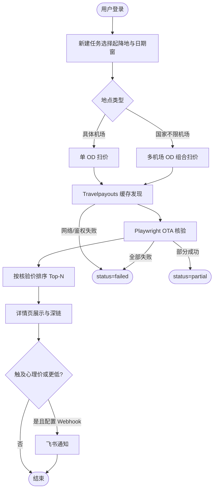

# Gatefare · Flight Monitor — PRD

| 字段 | 内容 |
|------|------|
| 文档版本 | 1.2 |
| 状态 | Active |
| 最后更新 | 2026-07-24 |
| 产品名 | Gatefare（Flight Monitor） |

## 1. 背景与问题

用户常有「大概哪几天出发、停留几天」的模糊出行计划，需要在日期窗内找出往返低价，并尽量看到可核对的真价与可打开的 OTA 链接。不愿为查价支付商业航班 API 费用。

## 2. 用户与场景

- **目标用户**：从中国大陆/港澳台出发的个人出行者。
- **场景 A**：一次性扫价（港→阪、港→柬埔寨等）。
- **场景 B**：定时盯价，跌破心理价时飞书通知。
- **场景 C**：只知道国家不知道机场，希望选「不限机场」或从列表选机场。

## 3. 目标与非目标

**目标**

- 免费查价管线：Travelpayouts 缓存发现 + Playwright OTA 核验。
- Top-N（默认 ≥10）按**核验价**排序展示。
- 深链（携程/去哪儿/Google）可打开且日期航线一致。
- 扫价过程持续有进度输出。
- 地点支持国家/城市/机场搜索与「不限机场」。
- **中国大陆出发/到达城市**：地点搜索覆盖 Travelpayouts 全部「可飞」城市码（本地目录，含中文名与英文别名）；港澳单独可选。

**非目标**

- 不提供自动下单、锁价、座位保证。
- 不接入付费航班搜索 API 作为生产主路径。
- 不用 demo/mock 冒充生产扫价成功。
- 「中国大陆（不限机场）」**不**展开全部数百城市（扫价组合爆炸）；仅展开主要枢纽列表。用户需具体城市时从搜索选中。

## 4. 功能范围

- 账户登录、管理员建用户、账户页飞书 Webhook 与健康状态。
- 任务 CRUD、立即扫价、定时调度。
- 地点建议 API + 前端 PlaceField。
- 中国大陆城市目录：`backend/app/data/cn_cities.json`（可用 `scripts/refresh_cn_cities.py` 从 Travelpayouts 刷新）。
- 扫价：多 OD（多机场）发现 → 核验池 → 实时进度/结果 → Top-N。
- 结果：缓存价 vs 核验价、航班摘要、三平台链接。

## 5. 主流程

## 6. 业务规则

- Fail-closed：无 token、`USE_DEMO=true`、TP 失败、核验全失败 → 不得展示假成功。
- 推荐排序仅用核验价；缓存价仅初筛。
- `top_n` 下限 10。
- 多机场任务：单机场 TP「不可飞」可跳过，不拖垮整次扫价；若最终零成功仍 `failed`。
- Travelpayouts 默认直连；代理须显式环境变量。

## 7. 验收标准（摘要）

- `/api/health` 在配置正确时 `ok=true`。
- 港阪日期窗扫价可得 ≥10 条核验结果（数据源允许时）或明确 `partial`/`failed`。
- 输入「柬埔寨」可选不限机场，任务 `dest_codes` 含多个 IATA。
- 输入「珠海」「日照」「淮安」等大陆城市可出现对应城市码建议；「中国大陆（不限机场）」仅含主要枢纽。
- 去哪儿/Google 深链可打开；携程 URL 形态正确（自动化可能 WhaleGuard）。
- 扫价中详情页有进度文案与百分比更新。

## 8. UI/UX 设计规范（2026-07-24 重构 · 航空邮件主题）

**方向**：复古航空邮件风，拒绝霓虹/赛博装饰。信息优先，动画仅保留状态反馈。

- **配色**：背景牛皮纸 `#E9E2D2`、卡片奶油纸 `#F4EFE3`、边框 `#D8CDB4` / `#B3A482`；主色墨绿 `#1F4D3A`（按钮、链接、选中态、进度条）；价格/最低价用朱红 `#C8352F` 强调；成功绿 `#3F7D5D` / 警示红 `#C8352F` 仅用于状态点。
- **航空斜纹**：每张卡片、列表、表格顶部有 4px 红绿相间的 -45° 斜纹条，呼应航空信封边缘；芯片用虚线框呼应邮票齿孔。
- **字体**：本地打包 woff2，不远程加载。标题/大数字 Playfair Display（衬线）+ 中文回退系统宋体；正文系统黑体（PingFang SC / Microsoft YaHei / system-ui）；数据/价格/时间戳 IBM Plex Mono + `tabular-nums`。
- **图标**：一律使用本地内联 Lucide SVG（`frontend/src/components/Icon.tsx`），禁止 emoji 作图标，禁止 CDN/远程图标。
- **动效**：只保留淡入、骨架屏、进度条、数字缓动、终端光标闪烁；删除雷达扫描、翻牌板、打字机、渐变流光文字、鼠标光斑、网格背景等纯装饰效果；尊重 `prefers-reduced-motion`。
- **布局**：顶栏（品牌 + 导航 + 健康状态 chip + 账户）；任务板为统计条 + 主从分栏（左任务列表 300px / 右任务详情卡 + 管线说明）；详情页为双列监控台（左进度卡含终端日志 / 右最低价卡）+ Top-N 行式表。

## 9. 测试计划

- 单测：`tests/`（deeplinks、places、fail-closed、TP、核验解析等）。
- E2E：健康检查 + 真实扫价或关键 API 冒烟（见 `AGENTS.md`）。

## 10. 发布与回退

- 本地：`start_web.bat` 或 uvicorn；前端 build 至 `backend/static`。
- Docker：`docker compose up --build`。
- 回退：还原 Git 提交；SQLite 新增列一般可保留。

## 11. PRD 变更记录

| 日期 | 说明 |
|------|------|
| 2026-07-24 | 中国大陆地点目录改为 Travelpayouts 全量可飞城市（本地 JSON）；「不限机场」仍只扩主要枢纽。 |
| 2026-07-24 | 初版整理；补充地点自动完成与不限机场、进度流式、深链保真、代理直连。 |
| 2026-07-24 | 前端整体重构为浅色设计系统：移除霓虹装饰组件（DepartureBoard/SplitFlap/Radar/TypeLine）、emoji 图标改本地 Lucide SVG、字体改系统栈。功能与 API 不变。 |
| 2026-07-24 | 皮肤定稿为「复古航空邮件」：牛皮纸底 + 墨绿操作色 + 朱红价格 + 卡片顶部红绿斜纹条；字体改 Playfair Display（衬线标题/大数字）+ IBM Plex Mono（数据）+ 系统黑体（正文），本地打包 woff2。任务板改主从分栏、详情页改双列监控台。e2e 验收 10 步全通过。 |
| 2026-07-23 | 混合管线与 Web 产品形态确立。 |
